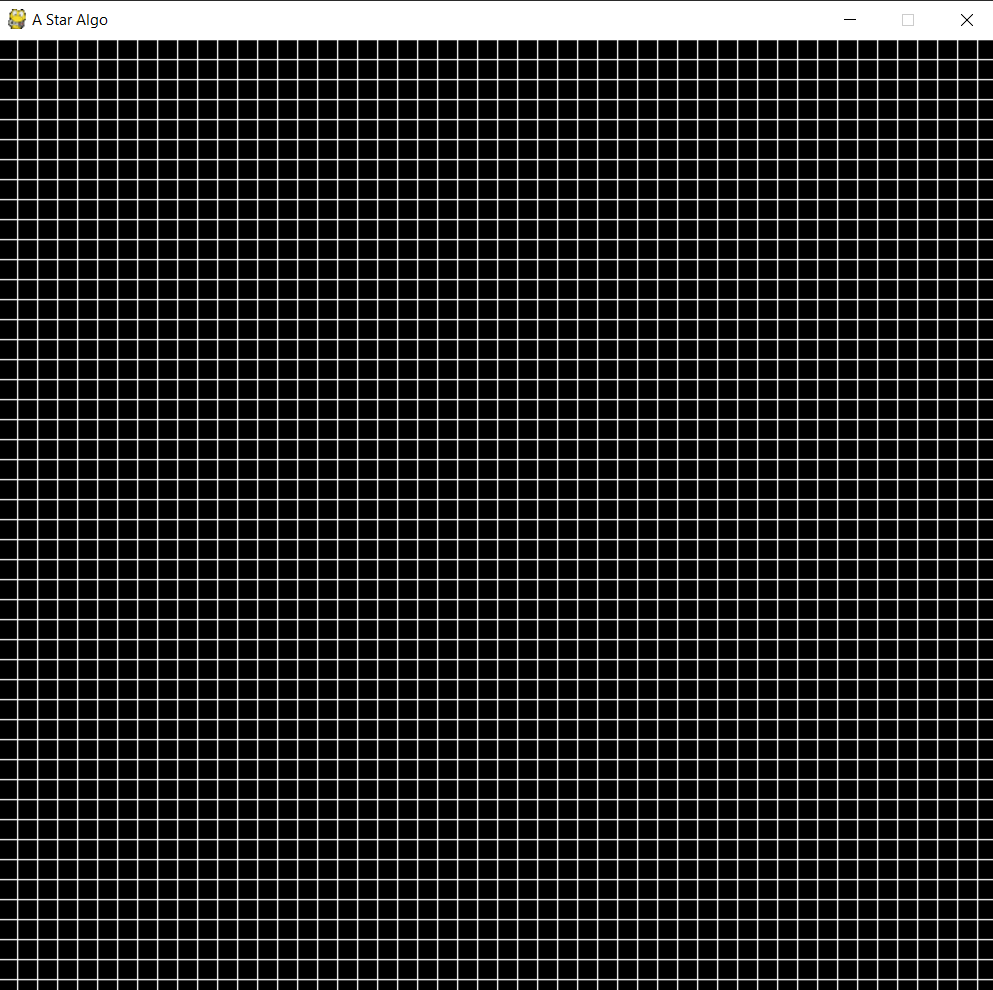
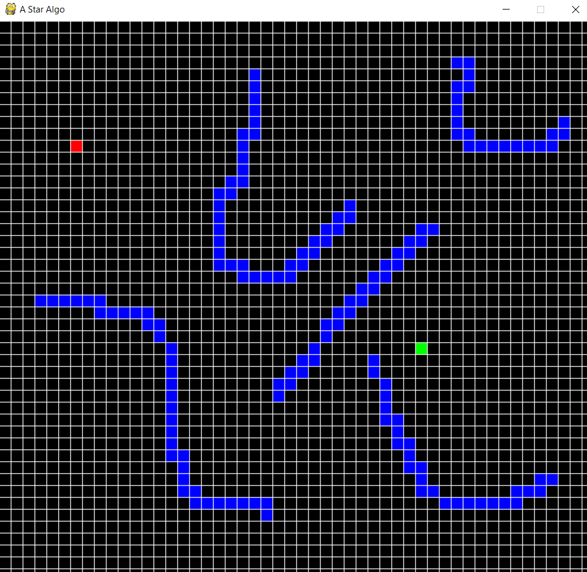
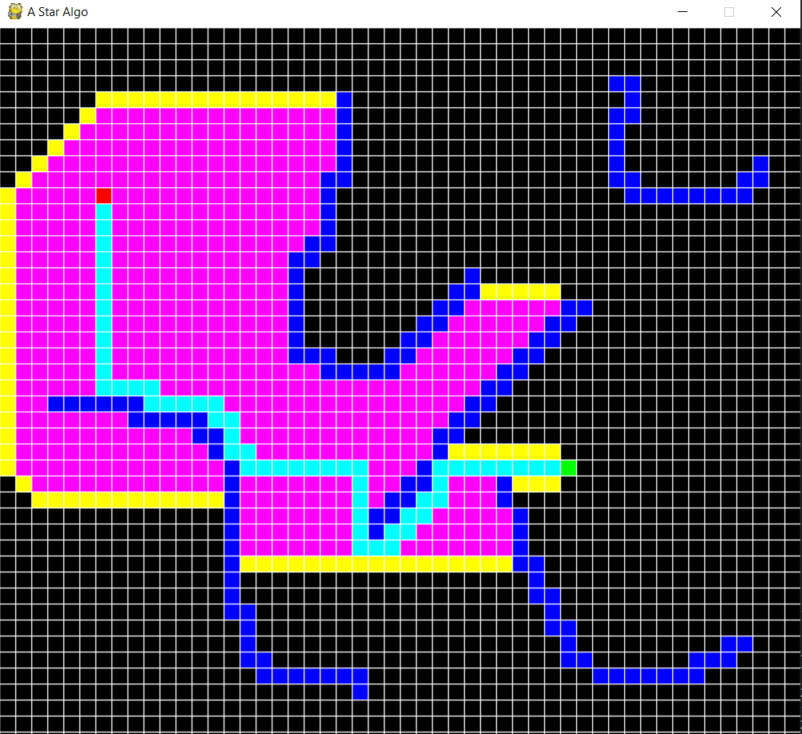

# Shortest-Path-Visual---A-Star-Algorithm
## Shortest Path Algo A-star implemented in pygame to show the process

 

## 1. First click assigns Source

 

## 2. Second click assigns Destination
 

## 3. Press mouse button and space simultaneously and move the mouse to assign Block Path (you can have multiple blocking paths)

 

## 4. Press Enter to start the process

 

## 5. Lastly, press any key to exit the window.

### *Note: yellow blocks are those that are still in queue to be processed, pink ones are already processed blocks, sky blue path is the shortest path*
